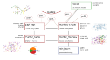

# mallink
Reinforcement learning + Monte Carlo and Markov chains for polymer/path systems

_overview of the mallink modules_

> computing
 
* `calc_finiteDiff.py`
	* finite difference implementation of differential equations
* `kernel_list.py`
	* collection of kernels
  

# antani

Ant - agent/network intelligence 

_ants optimizing paths on a network_

Antani is an agent/network based optimization engine for field operations

Content: 

## kpi

[kpi comparison](docs/antani_kpi.md)

* definition of kpis
* different kpi per run

_kpi comparison_

## engine

[engine functionalities](docs/mallink_engine.md) 

* list of moves
* performances

_engine description_

## graph

[graph building utilities](docs/geomadi_graph.md)

* retrieving a network
* building and fixing a graph

_graph formation_

## concept

[basic concepts](docs/antani_concept.md)

* agent
* network optimization

_antani concept schema_

